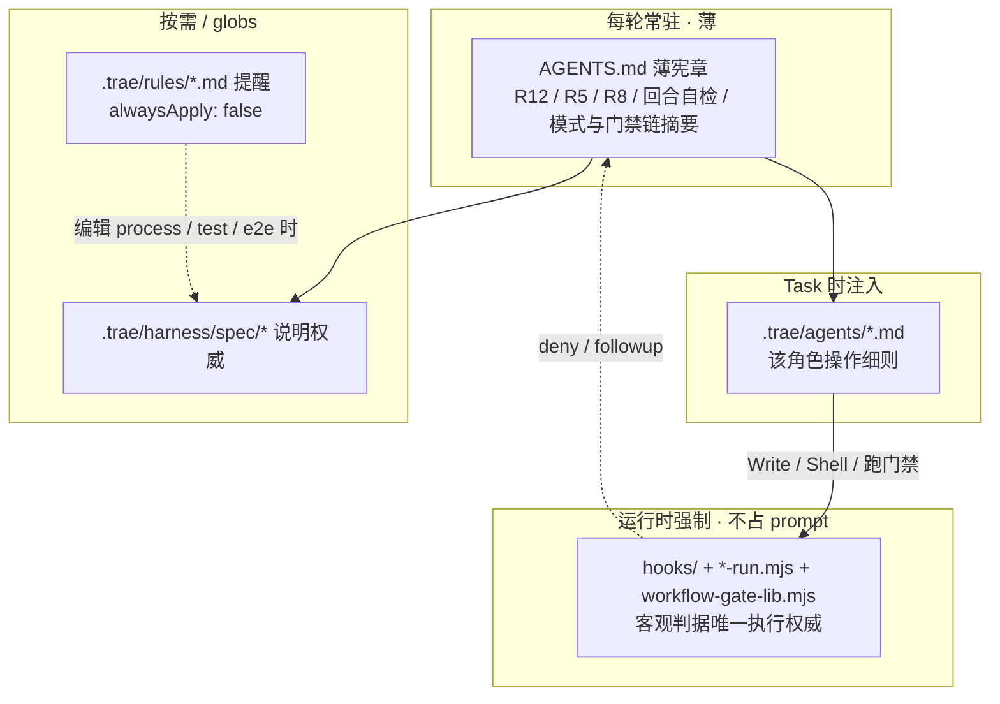

# Harness Engineering（Trae 适配版）

跨技术栈 AI 编程流程规约。本目录为 **Trae 版**。将本目录作为 Trae 工作区根目录，或将本目录内容整体复制到目标项目后使用（`harness.config.json` 已收纳于 `.trae/` 内）。

规约采用**分层权威**（薄宪章常驻 + Hook 机械强制 + 角色执行面 + `harness/spec` 说明细则）；架构说明见下文「规约权威分层」。日常用法从「快速开始」读起即可。

> **Trae 特有机制**：采用 **原生 Hook 自动拦截 + 顶层代理手动自检** 双保险门禁。`.trae/hooks.json` 遵循 Trae 标准格式（`PreToolUse`/`Stop` PascalCase 事件），客户端自动执行实现确定性拦截；同时 `.trae/rules/gate-protocol.md`（`alwaysApply:true`）强制顶层代理手动调用 `node .trae/scripts/gate-check.mjs` 作为兜底自检。7 个角色为 Trae 原生 Subagent（`.trae/agents/*.md`，frontmatter 含 `name`/`description`/`model`/`tools`，由内置 "Agent" 按 `description` 匹配调用）。详见 `.trae/harness/spec/trae-adaptation.md`。

## 前置条件

- **Trae IDE 版本 ≥ v3.3.67**：Subagent 目录支持（v3.3.67+）与 Hooks 功能（v3.3.66+）均需在此版本及以上方可正常工作。请在「设置 > Beta」中确认「启用 Subagents 目录」开关已打开。
- Harness Hook 与初始化脚本依赖 `Node.js >= 18` 执行 `.mjs` 文件。
- 目标项目的业务技术栈不限；具体运行时、包管理器与测试工具由系统架构师在设计阶段声明。

## 快速开始

**方式一：以本目录为工作区根。** 无需手动建目录，直接把本目录作为 Trae 工作区根，向 AI 提目标即可。

**方式二：接入已有项目。** 把**本目录的全部内容**复制到目标项目根目录，再以目标项目为 Trae 工作区根。至少须含 `.trae/`、`AGENTS.md`、`playwright.config.ts`、`e2e/` 目录骨架（含 `e2e/specs/README.md`）与 `.gitignore`。`playwright.config.ts` + `e2e/` 是 `.trae/harness/spec/mechanical-gates.md` §8.3 真实浏览器 E2E 机械门禁的运行时依赖，**不可省略**；`.gitignore` 随之复制可确保 `test-results/`、工具链批准标记等运行时产物在宿主项目同样不被提交（`.trae/harness/spec/mechanical-gates.md` §8.4 严格成立）；`README.md` 可选（供团队参考）。

无论哪种方式，后续步骤相同：

1. **向 AI 提出目标**，例如：

   > 请按 Harness 流程开发一个 XXX 工具，技术栈待定。

2. **首次对话时**，项目经理会自动初始化 `docs/` 结构（执行 `node .trae/scripts/bootstrap-docs.mjs` 或等价 Write），并写入 `.trae/harness-state.json` 指向当前活跃流程。你不需要自己 `mkdir` / `copy`。

3. **顶层代理执行顺序**：
   - 先单独调用 `project-manager` 记录用户目标
   - 再按当前活跃 `process.md` 中 `## 待派发角色列表` 机械发起各角色 Task

4. **（可选）手动初始化**：仅当你要在无 AI 环境下预先建目录时，可执行 `node .trae/scripts/bootstrap-docs.mjs`；Feature 迭代可执行 `node .trae/scripts/bootstrap-docs.mjs --feature=feature-name`。

5. **轻量模式**（用户显式声明时生效）：`hotfix`（热修复/修bug，测试环节按 R11 折叠为单次）、`docs-only`（只改文档）、`single-task`（单任务/小改动）。触发关键词、简化路径与迭代分诊判定的完整定义见 `.trae/harness/spec/workflow-modes.md`；门禁链见 `.trae/harness/spec/gate-chain.md`（`AGENTS.md` §4/§6 为常驻摘要，此处不复述以避免漂移）。轻量模式须在 `process.md` frontmatter 中设置 `workflow_mode`。

6. **流程终止（不可逆）**：明确表达「取消」「终止流程」等意图时，项目经理会先用 `AskQuestion` 做二次确认；确认后该流程的 `process.md` 被 Hook 永久冻结（`cancelled: true`），任何角色均无法再修改或恢复，需继续须发起新流程。完整定义见 `.trae/harness/spec/workflow-modes.md`「流程终止（不可逆，R10）」与 `AGENTS.md` §4 摘要。

## 目录结构

```
trae/                         # 适配 Trae 的完整规约根（目录名任意）——作为 Trae 工作区根，或整体复制到宿主项目根
├── AGENTS.md                 # 薄宪章（常驻）：编排硬约束 + 权威索引；非公式长文 SSOT
├── README.md                 # 本文件：用法 + 架构说明（给人看）
├── .gitignore                # 忽略 test-results/、工具链批准标记、依赖/构建产物（随本目录一并复制到宿主）
├── playwright.config.ts      # E2E 机械门禁运行时配置（仅 Chromium project）
├── e2e/
│   └── specs/                # E2E 用例骨架（空目录 + README，用例由 test-engineer 按项目编写）
└── .trae/                    # Harness 框架机件
    ├── harness.config.json   # 门禁路径、Shell 模式、工具链 TTL、QE 命令覆盖
    ├── harness-state.json    # 运行时生成：当前活跃 process.md 指针
    ├── harness/
    │   └── spec/             # 说明权威（按需阅读 / 改门禁时必读）
    │       ├── trae-adaptation.md    # Trae 工具特有适配（Subagent 机制、双保险门禁、工具清单）
    │       ├── mechanical-gates.md   # Hook 一览、stop 判据、R11/R14–R17/E2E、双要素豁免、能力边界
    │       ├── gate-chain.md         # 成果物门禁链展开、R9、无效成果物
    │       ├── workflow-modes.md     # 模式分诊、R2、路径约定、R10 步骤
    │       ├── rollback.md           # 回退计数与终止
    │       └── rule-index.md         # R/B/TG 编号导航（不新增约束）
    ├── rules/                # 渐进披露提醒（alwaysApply: false，靠 globs 挂载）+ 强制协议（alwaysApply: true）
    │   ├── gate-protocol.md          # Trae 门禁调用协议（alwaysApply:true，双保险：原生 Hook + 手动自检兜底）
    │   ├── harness-process.md
    │   └── harness-test-artifacts.md
    ├── agents/               # 角色执行面权威（Task 发起时注入该角色全文）
    ├── hooks.json            # Hook 注册（matcher 与脚本映射，Trae 标准格式）
    ├── hooks/                # 机械执行权威（确定性拦截；含 workflow-gate-lib.mjs）
    ├── scripts/
    │   ├── bootstrap-docs.mjs   # 一键初始化 docs/ 结构（幂等）
    │   ├── gate-check.mjs        # Trae 手动门禁入口（dev-write/dev-shell/toolchain/role/stop 子命令）
    │   ├── e2e-run.mjs          # 批次/最终 E2E 门禁运行器（Chromium-only，见 mechanical-gates.md §8.3）
    │   ├── e2e-run-lib.mjs      # e2e-run.mjs 的纯函数库（P0 解析、gatePassed 判据）
    │   ├── e2e-run-lib.test.ts  # e2e-run-lib.mjs 的 vitest 单测（框架自测，见「框架自测」）
    │   ├── vitest.config.ts     # 上述单测的 vitest 配置
    │   ├── lint-run.mjs         # 编程规范（lint）硬门禁运行器（R15，见 mechanical-gates.md §8.2）
    │   ├── lint-run-lib.mjs     # lint-run.mjs 的纯函数库（gatePassed 判据）
    │   ├── static-scan-run.mjs     # 静态代码质量硬门禁运行器（R16：重复代码+安全扫描，见 mechanical-gates.md §8.2）
    │   ├── static-scan-run-lib.mjs # static-scan-run.mjs 的纯函数库（gatePassed 判据）
    │   ├── qe-run.mjs           # 跨技术栈 QE 命令运行器（Windows 退出码不可靠时的留痕手段）
    │   ├── gate-selftest.mjs    # 门禁逻辑回归自检（库函数单元级）
    │   └── gate-scenarios.mjs   # 场景级门禁回归（端到端真调 5 个 Hook；框架维护用，不参与宿主项目开发）
    └── templates/            # 成果物模板
```

> **目录布局说明**：除 `AGENTS.md`（Trae 按约定在根目录读取）与 E2E 运行时依赖（`playwright.config.ts`、`e2e/`，Playwright 生态惯例要求配置文件在项目根）外，框架机件统一收敛在 `.trae/` 下——既避免与宿主项目的 `scripts/`、`templates/`、配置文件等同名冲突，又使「复制 `.trae/` + `AGENTS.md` + `playwright.config.ts` + `e2e/`」成为自洽的分发单元。运行时生成物在 `docs/` 与 `test-results/`，分别由项目经理与 `e2e-run.mjs`/`lint-run.mjs`/`static-scan-run.mjs`/`qe-run.mjs` 自动创建。
>
> **跨平台**：示例命令以 Windows（PowerShell / winget / VS Build Tools）居多，仅为示例；macOS/Linux 请使用等价工具（`brew`/`apt`/`dnf` 等）。禁止使用未确认的管道安装（如 `curl | sh`、`iwr | iex`）绕过工具链确认流程。

## 规约权威分层（架构）

本适配把「约束强度」与「常驻体积」拆开：**根 `AGENTS.md` 变薄 ≠ 规约变松**。客观条件由 Hook 强制；编排禁令常驻进 prompt；长公式与操作细则按场景携带。



### 五层分别管什么

| 层 | 路径 | 是否每轮进上下文 | 权威类型 | 放什么 | 不放什么 |
| -- | ---- | ---------------- | -------- | ------ | -------- |
| **A 宪章** | `AGENTS.md` | **是**（Trae 根文件整份常驻） | 编排文字约束 + 索引 | 角色指针、R12、顶层 MUST/MUST NOT、回合自检、模式/门禁链**摘要**、禁止绕过 Hook、权威索引 | 公式展开、豁免字段表、Hook 能力边界长文 |
| **B 机械** | `.trae/hooks/**`、`.trae/scripts/*-run.mjs`、`workflow-gate-lib.mjs` | 否（执行时强制） | **执行权威** | `gatePassed`、deny/followup、R3/R9/R10/R13–R18 等可机读判据 | 语义审查（命名是否合理、对账是否查到真数据等） |
| **C 角色** | `.trae/agents/*.md` | 仅该角色 Task 时 | **执行面权威** | PM 分诊/R2/R9/R10；QE 的 R15/R16 操作；TE 的 R14/R17/E2E 操作；SA 豁免声明等 | 顶层代写禁令（仍在宪章）；与 Hook 冲突的「可跳过」说法 |
| **D 说明** | `.trae/harness/spec/*.md` | 否（人审 / 改门禁 / Agent 按需 Read） | **说明权威**（叙述 SSOT） | Hook 一览、stop 优先级、E2E/R14–R17 公式、双要素豁免表、无效成果物、模式细则、Trae 工具特有适配 | 替代 Hook 执行（文档不能单独放宽） |
| **E 提醒** | `.trae/rules/*.md` | 否（`globs` 命中时） | 辅助提醒 | 编辑 `process.md` / 测试产物时的短指针 | `alwaysApply: true` 的编排硬约束副本（会漏挂载或重复占 token） |

对照索引亦写在 `AGENTS.md` §3；编号导航见 `.trae/harness/spec/rule-index.md`。

### 谁说了算（冲突时）

1. **客观可判定**（文件是否存在、`gatePassed`、进度行状态、双要素豁免字段等）→ **以 Hook / 脚本代码为准**；说明文档须与代码同步（R12：只可加强，不可放松）。
2. **顶层编排禁令**（不得代写、不得越级 Task、回合自检、`cancelled` 不可逆等）→ **以 `AGENTS.md` 常驻条文为准**；Hook 盖不住的部分（尤其「谁在调用」）靠文字 + 自检。
3. **角色怎么干活** → **以对应 `agents/{角色}.md` 为准**；Task `prompt` 不得覆盖角色文件强制约束（`AGENTS.md` §2.4）。
4. **长公式/豁免表怎么写给人看** → **以 `harness/spec/mechanical-gates.md`（及 gate-chain / workflow-modes / trae-adaptation）为准**；README / 角色文件只保留操作摘要 + 指针，避免三处漂移。

### 按场景读哪里

| 你在做… | 先看 | 再看 |
| -------- | ---- | ---- |
| 日常开发（用户提目标） | `AGENTS.md` 摘要 + PM 分派 | 对应角色 `agents/*.md` |
| 改门禁判据 / 跟 followup | Hook 源码 + `mechanical-gates.md` | `gate-selftest` / `gate-scenarios` |
| 改模式 / R10 取消流程 | `workflow-modes.md` + `project-manager.md` | `AGENTS.md` §4/§5.19 |
| 改 hotfix 前置 / 无效成果物 | `gate-chain.md` + PM | Hook 中 R9/R3 相关函数 |
| 跑 QE（lint / 静态扫描） | `quality-engineer.md` | `mechanical-gates.md` §8.2 |
| 跑测试 / E2E / R14 / R17 | `test-engineer.md` | `mechanical-gates.md` §8.3 |
| 声明某门禁不适用 | `system-architect.md`（写 `gated-artifacts.json`） | 双要素表：`mechanical-gates.md` §8.2；PM 补用户确认 |
| Trae 特有机制（Subagent / 双保险 / 工具清单） | `trae-adaptation.md` | `gate-protocol.md`（`alwaysApply: true`） |
| 复盘合规 | `.trae/skills/project-retrospective/` | 上表对应权威路径 |

### 维护红线（避免「瘦文档 = 松门禁」）

- **禁止**把 R5 / R8 / 回合自检 /「禁止绕过 Hook」改成仅靠 `description` 智能拉取的 rules——漏挂载会直接降低编排强度。
- **禁止**只改 `AGENTS.md` / spec 措辞来迁就较弱实现；发现文档强于代码时须**补齐 Hook**（R12）。
- **禁止**把 §8 公式长文再堆回根 `AGENTS.md` 当「第二份执行权威」；常驻只留结论与指针。
- **允许**加厚 `agents/*` 与 `harness/spec/*`；改行为后必须同步说明权威，并跑下文「框架自测」。
- `rules/*.md` 仅作 globs 提醒与强制协议：`gate-protocol.md` 为 `alwaysApply: true`（双保险兜底）；`harness-process.md` → `docs/**/process.md`；`harness-test-artifacts.md` → 测试/QE/E2E 相关路径；后二者均为 `alwaysApply: false`。

## 框架自测（可选）

Harness 自带回归自测，用于在修改 Hook / 脚本 / 模板后验证门禁判定逻辑未被破坏：

- **门禁逻辑自检（单元级）**：`node .trae/scripts/gate-selftest.mjs`（纯 Node，无需额外依赖；覆盖 R3 / R6 / B1 / R9 / R10 / R11 / R13 / R14 / R15 / R16 / R17 / **R18** 最低必测集及 Finding #1 回归，退出码非 0 即失败）。
- **场景级门禁回归（端到端）**：`node .trae/scripts/gate-scenarios.mjs`（纯 Node，无需额外依赖）。它**真正 spawn 框架自己的 5 个 Hook 入口脚本**（`gate-role-sequence` / `gate-dev-workflow` / `gate-dev-shell` / `gate-toolchain-install` / `gate-stop-workflow`），在隔离 fixture（`test-results/.gate-scenarios/`，经 `HARNESS_PROCESS_PATH` / `HARNESS_GATED_ARTIFACTS_PATH` 指向）上逐条断言 `allow/deny/ask/followup`，E2E 判据用 `e2e-run-lib.mjs` 真实计算；覆盖 Greenfield / Feature / Hotfix（R11 折叠）/ 对抗健壮性 / R14 批次接口测试报告 / R15 编程规范 lint 门禁 / R16 静态代码质量门禁 / R17 业务数据存储对账 / **R18 设计审核可修复性与需求覆盖** / Finding #1 与 Finding #2 回归，退出码非 0 即失败。附 `--verbose` 打印每步 deny/ask/followup 首行原因。
  - **定位**：此套件是**规约框架自身的维护用回归测试**，由早期一次性评估探针（原 `eval/`）沉淀而来；它**不参与任何宿主项目的开发流程**，不被 `hooks.json` / `qe-run.mjs` / `lint-run.mjs` / `static-scan-run.mjs` / `e2e-run.mjs` 引用，全程使用自建隔离 fixture，运行前会快照、运行后会还原 `test-results/e2e/`、`test-results/qe/.lint-result.json` 与 `test-results/qe/.static-scan-result.json` 下的运行时产物，不改动 `docs/` 成果物。
  - **何时运行**：改动任一 Hook、`workflow-gate-lib.mjs`、`e2e-run-lib.mjs`、门禁相关脚本或 `.trae/templates/process.md` 后，先跑 `gate-selftest.mjs` 再跑 `gate-scenarios.mjs`；两者全绿方可提交（呼应 AGENTS.md R12「只可加强，不可放松」——回归失败即意味着门禁被意外放松/破坏）。
- **`e2e-run-lib` 单测**：`.trae/scripts/e2e-run-lib.test.ts` 使用 vitest（配置见 `.trae/scripts/vitest.config.ts`）。本框架目录不预置 `package.json`，运行前需先在工作区安装 vitest，例如：

```bash
npm i -D vitest
npx vitest run --config .trae/scripts/vitest.config.ts
```

> `playwright.config.ts` 依赖 `@playwright/test`，同样需按 `.trae/harness/spec/mechanical-gates.md` §8.3 与各角色文件的工具链确认流程安装后方可运行 E2E 门禁。

**项目复盘 skill**：迭代结束或流程终止后，可在 Trae 中手动附加 skill `project-retrospective`（`.trae/skills/project-retrospective/`），对照规约评估执行合规性、产出须审核的改进建议，并对已批准项改规约后运行上文「框架自测」。

## 子 Agent 与 Task 映射

7 个角色文件及其 `name`/`description`/`model`/`tools` frontmatter 定义见 `.trae/agents/*.md`；`model` slug 的合法性要求与失配后果见 `AGENTS.md` §1（本文件不重复维护）。

Trae 原生 Subagent 由内置 "Agent" 按各 Subagent 的 `description` 字段匹配调用，`model` 字段指定运行时模型，`tools` 字段按最小权限原则限定可用工具集。发起 Task 时 `prompt` 须引用对应角色定义，且不得越权。Trae Subagent 机制详情（工具清单、用户交互方式等）见 `.trae/harness/spec/trae-adaptation.md`。

### Task Prompt 最小上下文

顶层代理发起子角色 Task 时，`prompt` 只传递以下信息，不得替子角色指定内部实现步骤：

- 用户目标与用户已确认摘要；
- 当前活跃 `process.md` 路径；
- 已存在成果物路径；
- 项目经理在 `## 待派发角色列表` 中写明的目标角色、开发线、任务包编号；
- 质量报告 / 测试报告中的待整改问题（仅整改阶段）。

## 技术栈扩展

系统架构师在 `docs/design/gated-artifacts.json`（可选）中声明本项目额外受门禁保护的路径与初始化命令，Hook 会与 `harness.config.json` 默认项合并。

模板见 `.trae/templates/gated-artifacts.json`。

Feature 迭代时，对应文件位于 `docs/{feature-名称}/design/gated-artifacts.json`，Hook 会根据 `.trae/harness-state.json` 或环境变量 `HARNESS_PROCESS_PATH` 定位当前活跃 feature。

## 配置说明

- **门禁路径**：`.trae/harness.config.json` → `gatedPaths`
- **根目录/基础设施门禁**：`.trae/harness.config.json` → `gatedPaths.rootPatterns`
- **`.trae/` 内部治理门禁（R6）**：`.trae/scripts|agents|hooks/**` 三目录默认纳入机制门禁；白名单豁免见 `gatedPaths.dotTraeExemptPatterns`（模板/rules/运行时状态/hooks 与 config 注册文件/工具链批准标记）
- **Shell 拦截**：`gatedShellPatterns` + 项目级 `gated-artifacts.json`；`hooks.json` 采用宽 matcher，具体是否拦截由脚本读取配置判定
- **工具链安装批准**：`toolchain.installPatterns` 命中后，用户确认并创建 `.trae/hooks/.toolchain-install-approved.json`（默认 60 分钟有效）
- **QE 命令覆盖**：`.trae/harness.config.json` → `qe.commands`（可选）；未声明时 `qe-run.mjs` / `lint-run.mjs` 按项目根目录构建清单文件自动探测技术栈并选用默认 test/lint/audit 命令。当自动探测不准确（如 monorepo/workspace）时，在 `qe.commands` 中显式声明本项目的 test/lint/audit 命令予以覆盖
- **编程规范 lint 门禁（R15）**与**静态代码质量门禁（R16：重复代码 + 安全静态扫描）**：执行命令、机读产物路径、命令解析优先级、`gatePassed` 判据与双要素豁免机制的**说明权威见 `.trae/harness/spec/mechanical-gates.md` §8.2**（执行权威：Hook/脚本；此处不复述以避免漂移）。速查：lint 产物 `test-results/qe/.lint-result.json`；静态扫描产物 `test-results/qe/.static-scan-result.json`；两者均为发起 test-engineer 与全流程收尾的前置条件。首次运行 `static-scan-run.mjs` 需联网经 `npx` 拉取 `jscpd-rs`/`gitleaks-secret-scanner`，建议固化为项目 devDependency 以避免重复下载；离线环境走 `qe.commands` 覆盖或豁免
- **活跃流程路径**：`.trae/harness-state.json` → `activeProcessPath`；可用环境变量 `HARNESS_PROCESS_PATH` 临时覆盖
- **流程角色识别**：Hook 读取 `process.md` 时同时识别中文角色名和 agent slug（例如 `开发工程师` / `development-engineer`）

修改 Hook 或配置后，请同步更新 `.trae/harness/spec/mechanical-gates.md`，并核对 `AGENTS.md` §3 权威索引与相关 `agents/*.md` 指针仍指向正确路径（R12：文档与实现同向加强，不得只砍文档）。
